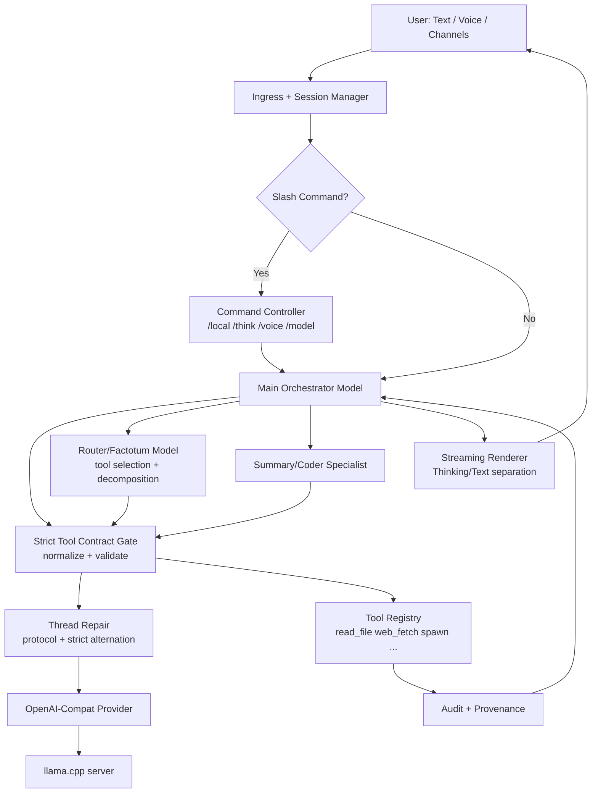

# Local SOTA Trio Strategy (2026-02-18)

## Goal
Stabilize nanobot for local-first operation (text + voice + tools) without losing the work already done in:
- `plans/local-model-reliability-tdd.md`
- `plans/streaming-rewrite.md`
- `skills/slm-agentic-reliability/references/reliability-gates.md`
- `skills/slm-agentic-reliability/references/loop-reliability-patterns.md`

## Failure Signals Seen Today
From `~/.nanobot/sessions/cli_default_2026-02-18.jsonl` and `~/.nanobot/workspace/memory/audit/cli_default.jsonl`.

1. Local template role crash:
- `Only user, assistant and tool roles are supported, got system`

2. Local template alternation crash:
- `After the optional system message, conversation roles must alternate user/assistant/...`

3. Tool contract drift:
- `Error: Tool 'wait' not found`
- repeated `spawn` calls missing `task`

4. Tool misuse loops:
- user asked "no web_search", model repeatedly called `web_search`

5. Freshness/reliability mismatch:
- user asked for "today's headlines", model reused stale page output

6. `/thinking` command inconsistency:
- `/thinking` appears in user session history (indicates slash command not intercepted in that path)

## What Is Already Fixed In Code

1. Strict tool contract normalization and validation:
- `src/agent/tools/registry.rs`
- alias map (`wait/check/list/cancel -> spawn`)
- arg normalization (`q -> query`, `link -> url`, `file -> path`, `id -> task_id`)
- required-arg validation by tool/action

2. Spawn schema clarity:
- `src/agent/tools/spawn.rs`
- `oneOf` action-specific requirements (`task`, `task_id`, `steps`)

3. Local-safe provenance warnings:
- `src/agent/agent_loop.rs`
- use `user` role for local-mode warning injections

4. Legacy-session hardening for local strict alternation:
- `src/agent/thread_repair.rs`
- convert non-leading `system` messages into user notices during local strict-alternation repair

## Architecture (Mermaid)



## Architecture (ASCII)

```text
User (text/voice/channel)
  -> Ingress/session
    -> Command controller (/local, /think, /voice)   [if slash cmd]
    -> Orchestrator model                             [normal turns]
         -> Router/factotum model (tool planning)
         -> Specialist model (summary/coding)
         -> Strict tool gate (normalize/validate)
         -> Thread repair (protocol + alternation)
         -> OpenAI-compat -> llama.cpp
         -> Tools (spawn/read/web/exec/...)
         -> Audit + provenance feedback
         -> Streaming renderer (text + thinking)
```

## Recommended Trio Roles

1. Main orchestration:
- Candidate: `ministral8b` or `nemotron-nano`
- Job: user intent, task decomposition, final synthesis
- Constraints: low temperature, strong system policy, short reply budget unless long-form trigger

2. Function router/factotum:
- Candidate: Gemma-class small model
- Job: choose tool + arguments only (no prose)
- Constraints: JSON-only output, deterministic schema, retries disabled for schema failures

3. Summary/extraction/coding specialist:
- Candidate: `qwen3-1.7b` for summary/extraction, `qwen2.5-coder` for code-heavy tasks
- Job: compress outputs, produce markdown tables, generate code patches
- Constraints: bounded context slices, fixed output schema

## "Three Impossible Challenges" Rollout

1. Challenge 1: Protocol Purity
- Target: 100 consecutive local turns with 0 role/protocol template failures.
- Gate: no `system-role` crash, no alternation crash, no orphan tool messages.

2. Challenge 2: Tool Discipline Under Pressure
- Target: 95%+ correct first tool choice across stressed prompts.
- Gate: no repeated wrong-tool loops, no missing required args, no alias-tool failures.

3. Challenge 3: Drift Resistance (5+ turns)
- Target: maintain role fidelity and tool fidelity after turn 5.
- Gate: no fallback-to-generic behavior, no "acting instead of doing", no phantom claims.

## Cross-Mode Applicability

Works for:
- local text mode
- local voice mode (same orchestration path, TTS/STT wrapper only)
- channel text mode (Telegram/WhatsApp/etc.)

Needs one additional unification:
- apply slash-command interception in non-REPL ingress paths so `/thinking`, `/nothink`, `/local` behave consistently everywhere.

## Keep/Improve (Do Not Throw Away)

Keep:
- strict tool contract layer (already paying off)
- provenance + phantom detection
- thread repair pipeline
- streaming rewrite plan from `plans/streaming-rewrite.md`
- local reliability TDD/gates

Improve:
- centralized command interception before agent loop
- freshness policy (`web_fetch` direct-source first for "today/latest")
- per-role model pinning + anti-drift prompt contracts
- benchmark harness tied to reliability gates
